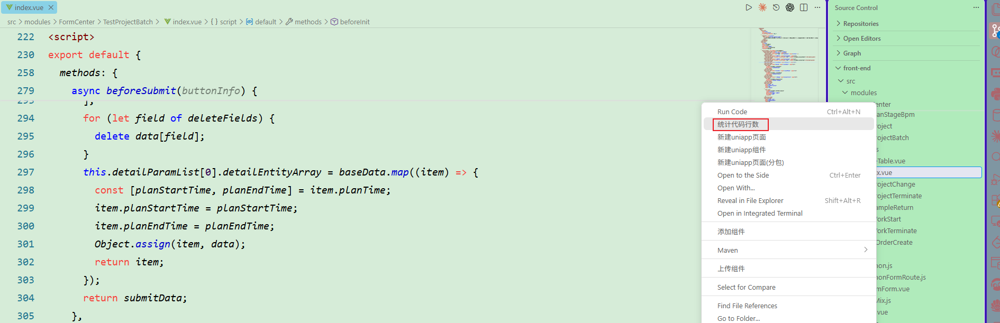
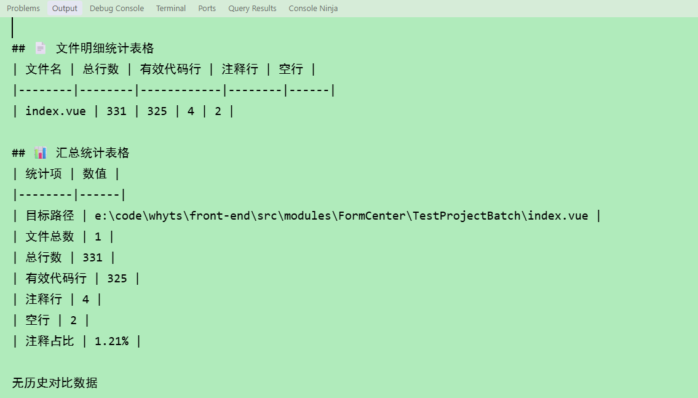
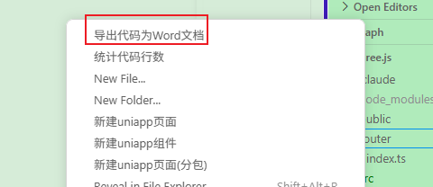
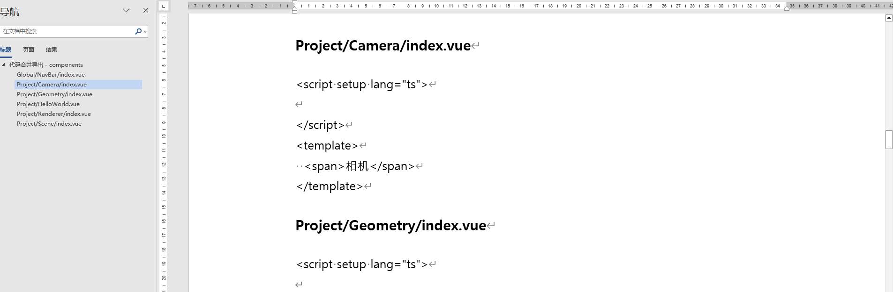
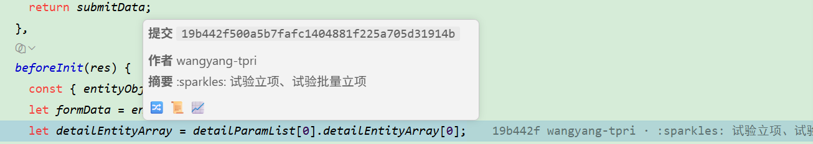
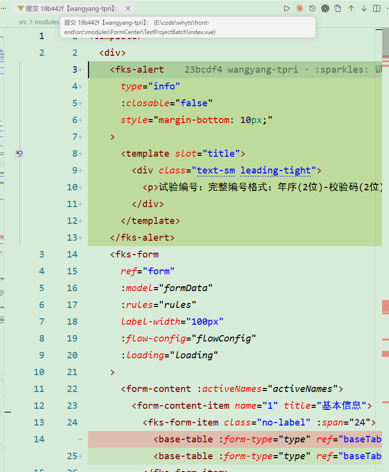
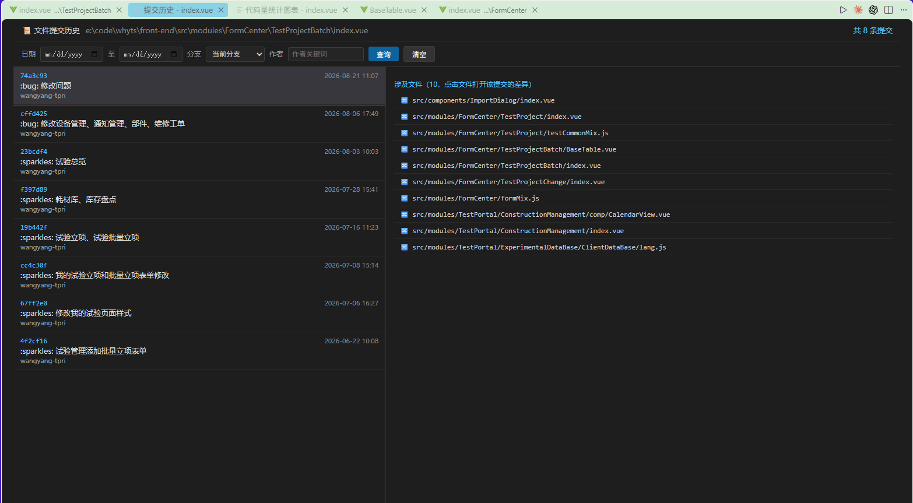
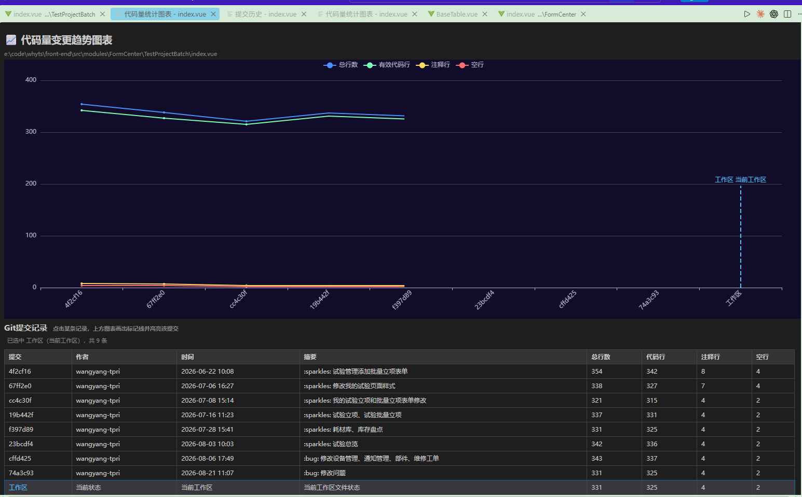

# coder-counter
## 介绍
- VSCode 代码数量统计、历史提交记录、文件提交差异、代码量统计图表插件
- 将选中文件夹中的所有代码导出为Word文档
## 功能
鼠标右键可以对选中的文件夹、文件进行代码行数统计，点击按钮，会在 Output 中展示统计结果。

鼠标右键选中对应的文件夹，将文件夹中的所有的文件代码导出为 wrod 文档

## 使用
安装插件后自动生效
### 文件中的代码获取焦点，在代码行的尾部自动展示 git 提交的 hash 信息。鼠标移动到 hash 信息上，弹出信息提示框

- 从左到右有3个图标，分别为：查看提交差异、查看文件提交历史、代码量统计图表
- 点击对应的按钮会有打开新窗口

## 命令行
- code-counter.countCode: 统计代码行数、文件信息
- code-counter.openChart: 打开统计可视化图表
- code-counter.openFileCommitHistory: 查看文件提交历史
## 版本
0.0.2 基础版本